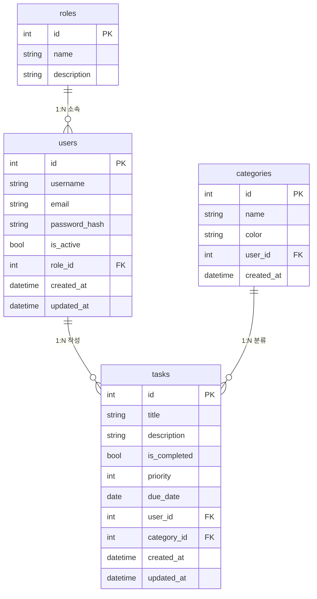

# 캡스톤 프로젝트 A: 가이드형 — 할 일 관리 앱 (Task Manager)

---

## 프로젝트 개요

| 항목 | 내용 |
|------|------|
| **유형** | 가이드형 (요구사항·ERD·와이어프레임 제공) |
| **시기** | 6주차(단원 6) ~ 9주차(단원 9) 병행 |
| **기반** | 보일러플레이트에서 출발 |
| **목표** | 각 단원 개념을 실제 기능 구현에 적용하며 체화 |

---

## 1. 요구사항 (PRD)

### 1.1 배경
학습자가 매일 업무에서 관리하는 할 일(Task)을 체계적으로 추적하는 데스크톱 앱입니다.

### 1.2 사용자 스토리
- 사용자로서, 할 일을 추가/수정/삭제할 수 있다
- 사용자로서, 할 일을 완료 표시할 수 있다
- 사용자로서, 카테고리별로 할 일을 분류할 수 있다
- 사용자로서, 우선순위와 마감일로 정렬할 수 있다
- 관리자로서, 모든 사용자의 할 일을 조회할 수 있다

### 1.3 기능 목록
| 기능 | 우선순위 | 설명 |
|------|----------|------|
| 할 일 CRUD | 필수 | 생성, 조회, 수정, 삭제 |
| 완료 토글 | 필수 | 체크박스로 완료/미완료 전환 |
| 카테고리 관리 | 필수 | 카테고리 생성, 할 일에 카테고리 지정 |
| 우선순위 | 필수 | 높음/중간/낮음 3단계 |
| 마감일 | 선택 | 날짜 입력, 마감 임박 표시 |
| 필터/정렬 | 선택 | 카테고리별, 상태별, 우선순위별 필터 |

---

## 2. ERD (Entity Relationship Diagram)



---

## 3. 아키텍처 다이어그램

```
┌─────────────────────────────────────────────┐
│                    UI 계층                    │
│  login_form.py │ main_window.py │ task_form.py │
│  navbar.py     │ task_list.py   │ components   │
└──────────┬──────────────────────┬────────────┘
           │  시그널/슬롯         │
┌──────────▼──────────────────────▼────────────┐
│                 Service 계층                   │
│    auth_service.py  │  task_service.py          │
│                     │  category_service.py      │
└──────────┬──────────────────────┬────────────┘
           │                      │
┌──────────▼──────────────────────▼────────────┐
│               Repository 계층                  │
│   user_repository.py  │  task_repository.py     │
│                        │  category_repository.py │
└──────────┬──────────────────────┬────────────┘
           │                      │
┌──────────▼──────────────────────▼────────────┐
│                Model 계층                      │
│     User  │  Role  │  Task  │  Category        │
└──────────┬──────────────────────┬────────────┘
           │                      │
┌──────────▼──────────────────────▼────────────┐
│              Database (SQLite/PostgreSQL)       │
└─────────────────────────────────────────────────┘
```

---

## 4. 단원별 연결 매핑표

| 단원 | 캡스톤 A에서 하는 작업 |
|------|----------------------|
| 단원 3 (SQL) | Task, Category 테이블 ERD 설계 |
| 단원 4 (ORM) | Task, Category 모델 + Repository 생성, Alembic 마이그레이션 |
| 단원 5 (PyQt5) | 할 일 목록 화면, 할 일 추가/수정 폼 |
| 단원 6 (설계) | PRD 검토, 작업 분해 (To-do) |
| 단원 7 (Claude Code) | 프로젝트 CLAUDE.md 작성, 커스텀 Skill 제작 |
| 단원 8 (디버깅) | 기능 구현 중 발생하는 버그 해결 |
| 단원 9 (검증) | 코드 리뷰, pytest 테스트 작성 |

---

## 5. 구현 단계별 가이드

### 단계 1: 모델 생성 (단원 4)

Claude Code에 입력:
```
할 일 관리 앱에 필요한 Task 모델과 Category 모델을 만들어줘.
보일러플레이트의 User 모델과 같은 패턴으로 작성해줘.
ERD는 위 설계를 따라줘.
```

### 단계 2: Repository 생성 (단원 4)

```
Task 모델에 대한 TaskRepository를 만들어줘.
user_repository.py와 같은 패턴으로 CRUD + 필터 메서드를 구현해줘.
```

### 단계 3: Service 생성 (단원 6)

```
TaskService를 만들어줘.
할 일 생성, 완료 토글, 카테고리 변경 로직을 구현해줘.
auth_service.py와 같은 패턴으로 작성해줘.
```

### 단계 4: UI 제작 (단원 5)

```
할 일 목록 화면(task_list.py)을 만들어줘.
QTableWidget으로 할 일 목록을 표시하고,
추가/수정/삭제/완료토글 버튼을 포함해줘.
main_window.py에 페이지로 등록해줘.
```

### 단계 5: 검증 (단원 9)

```
TaskService의 주요 메서드에 대한 pytest 테스트를 작성해줘.
정상 케이스 2개, 예외 케이스 2개를 포함해줘.
```

---

## 6. 프롬프트 일지 (템플릿)

학습자는 캡스톤 개발 중 주요 프롬프트를 아래 형식으로 기록합니다:

| 날짜 | 프롬프트 요약 | 결과 평가 | 수정 사항 |
|------|-------------|-----------|-----------|
| | | (좋음/보통/재시도) | |

---

## 7. 제출 요건

- [ ] 보일러플레이트에서 출발한 프로젝트
- [ ] Task, Category 모델과 Repository 구현
- [ ] TaskService 비즈니스 로직 구현
- [ ] 할 일 CRUD UI 동작
- [ ] pytest 테스트 2개 이상
- [ ] 프롬프트 일지 작성
- [ ] Git 커밋 히스토리 (최소 5개 커밋)
